# CI Community Center

The CI Community Center website is here to service people in the local area. It is designed to give people information about events at the center and allow them to book events or activities.

The site also allows local people to view pictures and videos of previous events via the gallery page.

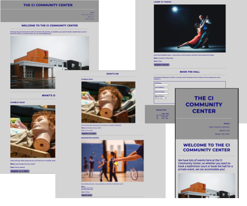

## Features 

### Existing Features

- __Navigation Bar__

  - Featured on all nine pages, the full responsive navigation bar includes links to the Home and Past Events Gallery page, and the Whats On and Book the Hall sections of the Home page and is identical on each page to allow for easy navigation. 
  - The Home page and Past Events Gallery page are emboldened when you are on the appropriate page to show the user their current location.
  - This section will allow the user to easily navigate from page to page across all devices without having to revert back to the previous page via the ‘back’ button. 

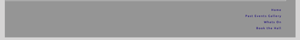

- __The Welcome Page section/image__

  - The landing page includes a photograph of the Community Center to indicate to the user the main function of the site. And give a clear idea of the purpose of the site. 
  - This section introduces the user to the CI Community Center and some of the functions of the site.

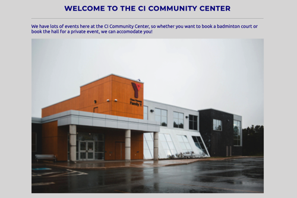

- __Whats On section__

  - The Whats On section allows the user to see the upcoming and regular events and activities running at the CI Community Center.
  - Each event or activity has its own section and allows the user to register their interest or book events.
  - This section will be updated regularly to include new events and udate availability.

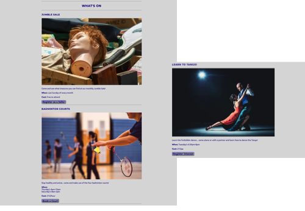

- __Book the Hall section__

  - This section will allow the user to request a booking for the hall to host a private event. 
  - The form requires information such as name, email address and phone number as well as when they want to book for. 

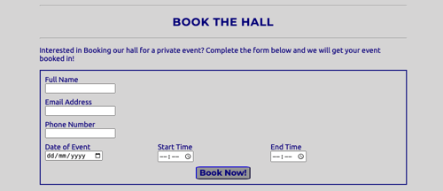

- __Book the Hall Success page__

  - This page will confirm to the user has successfully requested a booking for the hall for a private event.
  - The page shows a success statement and a link to return to the Home page.

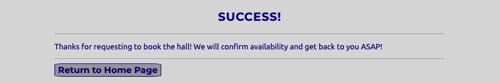

- __The Footer__ 

  - The footer section includes links to the relevant social media sites for the CI Community Center. The links will open to a new tab to allow easy navigation for the user. 
  - The footer section also includes the address of the Community Center and email and telephone clickable contact options.
  - The footer also allows users to see the openning hours for the Community Center.

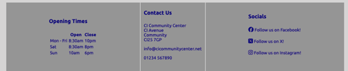

- __Past Events Gallery Page__

  - The gallery will provide the user with images and videos of previous events and activities. 
  - This section is valuable to the user as it will allow them to find photos and see what previous events and activities were like, encouraging them to book future events.

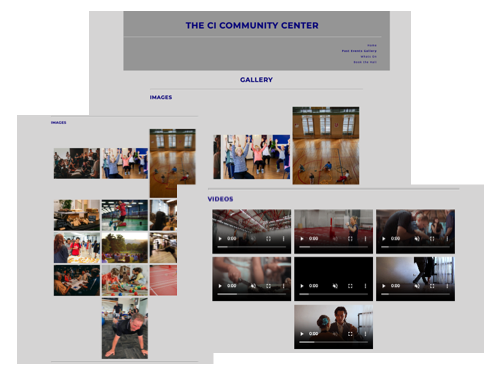

- __Book a Badminton Court page__

  - This page will allow the user to request a booking for a badminton court
  - The form includes details like their name, email address and phone number as well as when they want to book

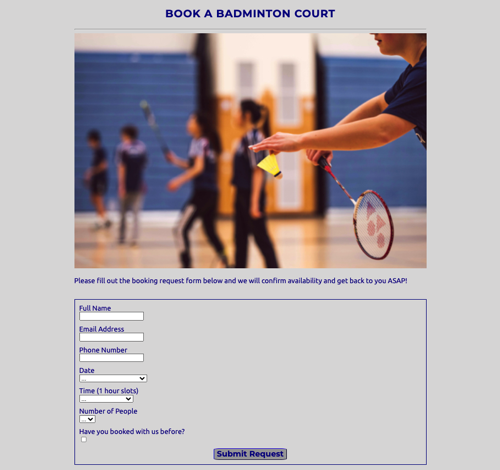

- __Badminton Court Booking Success page__

  - This page will confirm to the user that they successfully requested a booking for a Badminton Court.
  - The page shows a success statement and a link to return to the Home page.

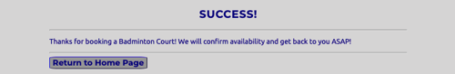

- __Jumble Sale Seller Registration page__

  - This page will allow the user to register their interest in becoming a seller at the monthly Jumble Sale.
  - The form includes details like their name, email address and phone number.

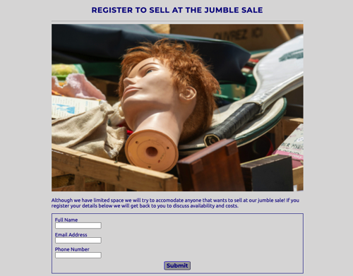

- __Jumble Sale Seller Registration Success page__

  - This page will confirm to the user has successfully registered their interest in becoming a seller at the monthly Jumble Sale. 
  - The page shows a success statement and a link to return to the Home page.

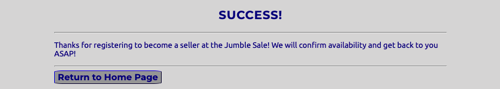

- __Learn to Tango Registration page__

  - This page will allow the user to register their interest in signing up for Tango classes.
  - The form includes details like their name, email address and phone number.

- __Learn to Tango Registration Success page__

  - This page will confirm to the user has successfully registered their interest in joining the learn to Tango classes.
  - The page shows a success statement and a link to return to the Home page.

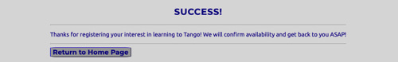

### Features Left to Implement

- Interactive calendar showing future events and activities
- Automated Booking system for activies (Badminton courts for example)

## Testing 

Having published the site, all pages, forms and links have been tested on multiple devices including
- 13" Laptop
- Large Monitor
- iPhone 15
- iPad Air

Using Google Inspect, all pages, forms and links have been tested for multiple different screen sizes including Pixel 7 and a Extra Wide Screen size as well as multiple other random sizes.

Images, videos and text all automatically adjust depending on screen size.

All Elements Shrink and grow to fit with no cropping, up to maximum widths and look good on all screen sizes.

3rd Party testing highlighted an issue with some screens showing a small margin to the right side of the footer. This was resolved by removing the "width" property in CSS for the heading section which was causing an overlap. 

### Validator Testing 

- HTML
  - No errors were returned when passing through the official [W3C validator](https://validator.w3.org/nu/?doc=https%3A%2F%2Fcode-institute-org.github.io%2Flove-running-2.0%2Findex.html)
- CSS
  - No errors were found when passing through the official [(Jigsaw) validator](https://jigsaw.w3.org/css-validator/validator?uri=https%3A%2F%2Fvalidator.w3.org%2Fnu%2F%3Fdoc%3Dhttps%253A%252F%252Fcode-institute-org.github.io%252Flove-running-2.0%252Findex.html&profile=css3svg&usermedium=all&warning=1&vextwarning=&lang=en#css)
- Colour Contrast
  - Rated as 11.18:1 Contrast ratio using [Adobe Colour Contrast Analyser](https://color.adobe.com/create/color-contrast-analyzer)
- Lighthouse
  - Scored 89 for Performance due to images and formats. Investigated and decided not to improve on this for now.
  - Scored 98 for Accessibilty
  - Scored 100 for Best Practices

### Unfixed Bugs

None at present.

## Deployment

- The site was deployed to GitHub pages. The steps to deploy are as follows: 
  - GitHub repository created using the UI.
  - Site was created using the Visual Studio Code program and linked to the GitHub repository.
  - Changes were committed and synchronised to the Github Repository.
  - Went to the GitHub online UI, Repository>>Settings>>Pages
  - From the source section drop-down menu, the main branch and the root directory were selected and saved.
  - GitHub then created the site and a detailed ribbon display to indicate the successful deployment was displayed.

The live link can be found here - https://gregp1985.github.io/ci-community-center/index.html

## Credits 

In this section you need to reference where you got your content, media and extra help from. It is common practice to use code from other repositories and tutorials, however, it is important to be very specific about these sources to avoid plagiarism. 

You can break the credits section up into Content and Media, depending on what you have included in your project. 

### Content 

- The Social Media Links section was copied from the [LoveRunning Site Repository](https://github.com/gregp1985/love-running/blob/main/index.html) 
- The README was templated from the [LoveRunning README Template](https://github.com/Code-Institute-Solutions/readme-template/blob/master/README.md)
- Fonts 'Ubuntu' and 'Montserrat' were imported through [Google Fonts](https://fonts.google.com/)

### Media

- The photos and videos used on all pages were taken from the free source [Pexels](https://www.pexels.com)
- The favicons used were generated by [Favicon](https://www.favicon.io)
- The icons in the footer were taken from [Font Awesome](https://fontawesome.com/)
